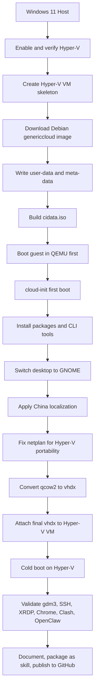

# Hyper-V Debian OpenClaw Skill

这个仓库沉淀了两类产物：

- 一套完整的 Debian GNOME on Hyper-V 制作与排障文档
- 一个可复用的 Codex skill：`$hyperv-debian-openclaw-vm`

核心目标是把一台 Windows Hyper-V 下的 Debian 虚拟机做成可直接用于：

- OpenClaw
- Codex CLI
- Gemini CLI
- Claude Code
- Google Chrome
- Clash Verge

## 仓库结构

- `docs/hyperv-debian-openclaw-vm-playbook.md`
  完整制作与排障手册
- `docs/final-validation.md`
  最终验收记录
- `skills/public/hyperv-debian-openclaw-vm/SKILL.md`
  skill 主入口
- `skills/public/hyperv-debian-openclaw-vm/references/`
  流程、踩坑、配置清单
- `skills/public/hyperv-debian-openclaw-vm/scripts/`
  宿主机侧检查脚本

## 流程图

## 方案原理

这套流程不是传统“安装 ISO + 人工点下一步”，而是：

1. 取一份已经装好基础系统的 Debian cloud image
2. 用 `cloud-init` 在第一次启动时注入用户、网络、软件安装、脚本和本地化配置
3. 得到一块已经初始化完成的成品系统盘
4. 再把这块盘挂到 Hyper-V 里长期使用

这里会出现两个不同性质的产物：

- 大系统盘镜像：`qcow2` / `raw` / `vhdx`
- 小配置介质：`cidata.iso`

`cidata.iso` 不是系统安装盘，它只是把 `user-data` 和 `meta-data` 交给 `cloud-init` 的数据源载体。

## 各阶段说明

### 1. 宿主机预检

做了什么：

- 检查管理员权限
- 检查 Windows 版本是否支持 Hyper-V
- 检查 CPU/BIOS 虚拟化支持

从哪获取：

- Windows 自带 PowerShell / `systeminfo`

补充了什么：

- 无外部下载

改了什么文件：

- 无

执行了什么：

- `Get-WindowsOptionalFeature`
- `systeminfo`
- `bcdedit /enum`

这一阶段宿主机需要安装什么：

- 无额外安装

### 2. 启用 Hyper-V

做了什么：

- 启用 `Microsoft-Hyper-V`
- 设置 `hypervisorlaunchtype=Auto`
- 重启并验证 Hyper-V 生效

从哪获取：

- Windows 可选功能

补充了什么：

- 无外部下载

改了什么文件：

- Windows 可选功能状态
- Windows 引导配置

执行了什么：

- `Enable-WindowsOptionalFeature -Online -FeatureName Microsoft-Hyper-V -All`
- `bcdedit /set hypervisorlaunchtype auto`

这一阶段宿主机需要安装什么：

- 无额外安装

### 3. 创建 Hyper-V 虚拟机骨架

做了什么：

- 创建二代虚拟机
- 配置 CPU、内存、磁盘、Secure Boot、DVD 驱动器

从哪获取：

- Hyper-V PowerShell 模块

补充了什么：

- 虚拟机骨架配置

改了什么文件：

- Hyper-V 虚拟机配置
- 初始 VHDX 文件

执行了什么：

- `New-VM`
- `Set-VM`
- `Set-VMProcessor`
- `Set-VMFirmware`
- `Add-VMDvdDrive`

这一阶段宿主机需要安装什么：

- 无额外安装

### 4. Debian 镜像选型

做了什么：

- 评估 Debian Live ISO
- 评估 `nocloud` / `genericcloud`
- 最终选 `genericcloud`

从哪获取：

- Debian 官方 cloud image 目录
- Debian 官方元数据 JSON

链接：

- `https://cdimage.debian.org/images/cloud/trixie/latest/`

补充了什么：

- 镜像选型结论

改了什么文件：

- 无

执行了什么：

- `curl` / `Invoke-WebRequest` 读取镜像目录和元数据

这一阶段宿主机需要安装什么：

- 无额外安装

### 5. 生成 cloud-init 数据源

做了什么：

- 编写 `user-data`
- 编写 `meta-data`
- 生成 `cidata.iso`

从哪获取：

- cloud-init NoCloud 方案

补充了什么：

- 用户
- 密码
- SSH 公钥
- 时区
- locale
- 包安装脚本
- GNOME/Chrome/Clash/OpenClaw/CLI 预装逻辑

改了什么文件：

- `automation/debian-vm/user-data`
- `automation/debian-vm/meta-data`
- `automation/debian-vm/build-seed.ps1`
- 最终产物：`cidata.iso`

执行了什么：

- 自定义 PowerShell 脚本生成 seed
- `oscdimg` 打包 ISO

这一阶段宿主机需要安装什么：

- `OSCDIMG`

### 6. 为什么先用 QEMU，再回灌 Hyper-V

做了什么：

- 不直接在 Hyper-V 里盲调 cloud-init
- 先在 QEMU 里做首轮安装和修复

原因：

- QEMU 更容易：
  - 暴露 SSH 端口
  - 看串口
  - 交互式登录
  - 快速试错

从哪获取：

- Windows 版 QEMU

补充了什么：

- 一条更可观测的引导路径

改了什么文件：

- 无固定仓库文件
- 会生成临时日志和中间镜像

执行了什么：

- 启动 `qemu-system-x86_64`
- 暴露 `127.0.0.1:2222 -> guest:22`

这一阶段宿主机需要安装什么：

- `QEMU`
- `qemu-img`

### 7. 在 QEMU 来宾中完成系统安装与修复

做了什么：

- 连接来宾
- 修 cloud-init、镜像源、网络配置
- 安装 Node 22
- 安装 Codex / Gemini / Claude / OpenClaw
- 安装 Chrome 和 Clash Verge
- 安装 GNOME 和 gdm3

从哪获取：

- Debian cloud image
- Node 官方发行包
- npm registry
- Google Chrome Linux 官方 `.deb`
- Clash Verge GitHub Releases

补充了什么：

- 用户环境
- 全局 npm 包
- 图形桌面
- 中文输入法
- 自启动和默认会话

改了什么文件：

- `/etc/apt/sources.list.d/*.sources`
- `/etc/netplan/*.yaml`
- `/etc/cloud/cloud.cfg.d/*`
- `/etc/X11/default-display-manager`
- `/etc/systemd/system/display-manager.service`
- `/home/claude/.profile`
- `/home/claude/.bashrc`
- `/home/claude/.xsession`
- `/home/claude/.dmrc`
- `/etc/default/locale`
- `/etc/dconf/...`
- `/home/claude/.config/autostart/Clash Verge.desktop`

执行了什么：

- `apt-get install`
- `npm install -g`
- `curl`
- `tar`
- `update-locale`
- `systemctl`
- `netplan generate`

这一阶段宿主机需要安装什么：

- 只需能运行 QEMU 和 SSH 客户端

### 8. 清华源为什么没有作为最终安装源

做了什么：

- 尝试把 Debian 系统包源切到清华

现象：

- `apt update` 可能成功
- 但大量 `.deb` 在 `pool/` 路径返回 `403 Forbidden`

处理：

- 切到 USTC 镜像完成实际安装

从哪获取：

- USTC Debian 镜像

改了什么文件：

- `*.sources`

执行了什么：

- `apt-get update`
- `curl -I` 针对单个 `.deb` 路径验证

这一阶段宿主机需要安装什么：

- 无额外安装

### 9. 将成品盘转回 Hyper-V

做了什么：

- 关闭 QEMU 来宾
- 将 `qcow2` 转为 `vhdx`
- 从 Hyper-V VM 卸载旧盘
- 挂载新盘
- 移除 seed ISO
- 冷启动 Hyper-V 验证

从哪获取：

- `qemu-img`

补充了什么：

- 最终长期使用的 Hyper-V 系统盘

改了什么文件：

- `C:\workspace\hyperv-debian-openclaw-skill\HyperV\Debian-Desktop\Debian-Desktop-os.vhdx`
- Hyper-V VM 附件配置

执行了什么：

- `qemu-img convert`
- `Remove-VMHardDiskDrive`
- `Add-VMHardDiskDrive`
- `Set-VMDvdDrive`

这一阶段宿主机需要安装什么：

- `qemu-img`

### 10. 修复 GNOME 开机不自动进入图形登录

做了什么：

- 排查为什么 Hyper-V 控制台落到 `login:`
- 发现 `lightdm` 残留覆盖了 `gdm3`
- 修复显示管理器链路

补充了什么：

- 正确的默认显示管理器

改了什么文件：

- `/etc/X11/default-display-manager`
- `/etc/systemd/system/display-manager.service`

执行了什么：

- `systemctl status gdm3`
- `systemctl start gdm3`
- `ln -sf /usr/lib/systemd/system/gdm.service /etc/systemd/system/display-manager.service`

这一阶段宿主机需要安装什么：

- 无额外安装

### 11. 本地化和 GNOME 体验收尾

做了什么：

- 时区设为 `Asia/Shanghai`
- locale 设为 `zh_CN.UTF-8`
- 安装 `ibus-libpinyin`
- 写 GNOME 默认收藏夹
- 让 Clash Verge 登录后自启动

从哪获取：

- Debian 包仓库

补充了什么：

- 中国本地化配置

改了什么文件：

- `/etc/default/locale`
- `/etc/dconf/profile/user`
- `/etc/dconf/db/local.d/00-gnome-local`
- `/home/claude/.config/autostart/Clash Verge.desktop`

执行了什么：

- `apt-get install ibus-libpinyin`
- `update-locale`
- `dconf update`

这一阶段宿主机需要安装什么：

- 无额外安装

### 12. 文档化与 skill 封装

做了什么：

- 将完整流程整理成 playbook
- 按 `skill-creator` 规范初始化 skill
- 写 `references/` 和 `scripts/`
- 校验 skill
- 发布 GitHub 仓库和 release
- 安装到本机 `~/.codex/skills` 和 `~/.agents/skills`

从哪获取：

- 本机 `skill-creator` 系统 skill
- GitHub CLI

补充了什么：

- 一个可复用 skill
- 一套可分享文档

改了什么文件：

- 仓库中全部文档和 skill 文件

执行了什么：

- `init_skill.py`
- `quick_validate.py`
- `git`
- `gh repo create`
- `gh release create`
- `robocopy`

这一阶段宿主机需要安装什么：

- `gh`
- Python

## 宿主机工具清单

本机实际需要过的工具：

- Hyper-V PowerShell 模块
- `systeminfo`
- `bcdedit`
- `qemu-img`
- `QEMU`
- `OSCDIMG`
- `Git`
- `GitHub CLI`
- `Python`
- `OpenSSH` 客户端

## 关键来源汇总

- Debian cloud images
  - `https://cdimage.debian.org/images/cloud/trixie/latest/`
- cloud-init NoCloud
  - `https://cloudinit.readthedocs.io/en/latest/reference/datasources/nocloud.html`
- Node.js
  - `https://nodejs.org/dist/latest-v22.x/`
- Clash Verge Release
  - `https://github.com/clash-verge-rev/clash-verge-rev/releases/latest`
- Google Chrome Linux
  - `https://dl.google.com/linux/direct/google-chrome-stable_current_amd64.deb`

## 命令历史

这次执行过的标准化命令已导出到：

- `C:\workspace\hyperv-debian-openclaw-skill\source\histoy.command`

说明：

- 这是可读版、归一化后的构建历史
- 重点保留了关键动作，不包含所有工具层包装噪声

## 当前状态

- Skill 仓库：
  - `https://github.com/Bahtya/hyperv-debian-openclaw-skill`
- Release：
  - `https://github.com/Bahtya/hyperv-debian-openclaw-skill/releases/tag/v0.1.0`
- 本地 skill：
  - `~/.codex/skills/hyperv-debian-openclaw-vm`
  - `~/.agents/skills/hyperv-debian-openclaw-vm`
