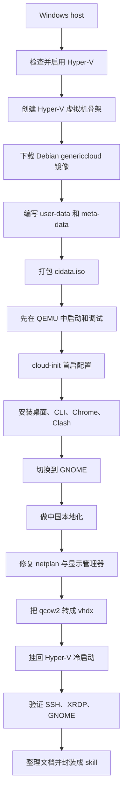

# Hyper-V Debian OpenClaw Skill

在 Windows Hyper-V 上构建一台 Debian GNOME 工作虚拟机，并把整个过程沉淀成可重复执行的文档和 skill。

这个项目不是单纯记录“我装过一次”，而是试图把下面这件事做成一个稳定、可复盘、可复制的工程流程：

- 基于 Debian cloud image 生成虚拟机
- 用 cloud-init 在首启时注入用户、网络和安装脚本
- 预装 OpenClaw、Codex CLI、Gemini CLI、Claude Code、Chrome、Clash Verge
- 解决 GNOME、gdm3、镜像源、Hyper-V 网络兼容这类高频坑
- 最终把经验封装成一个可复用的 skill：`$hyperv-debian-openclaw-vm`

## 适合谁

这个仓库适合下面几类人：

- 想在 Hyper-V 上快速做一台 Debian GNOME 桌面工作机
- 想把 OpenClaw 和几套 AI CLI 放进一台可长期复用的 Linux 虚拟机
- 想用 `cloud-init` 代替手工图形安装
- 想把一次性的踩坑过程整理成文档和自动化资产

如果你只想临时装一台 Debian 桌面机，直接用 Debian GNOME 安装 ISO 也可以。  
如果你想要“可重复构建、可自动化、可沉淀成 skill”的方案，这个仓库更有参考价值。

## 这套方案最终交付什么

目标是一台 Debian 13 GNOME 虚拟机，适合直接用作 OpenClaw / AI CLI 工作环境。

典型配置：

- Debian 13
- GNOME + gdm3
- SSH
- XRDP
- Node 22
- Python 3
- Git / GitHub CLI
- OpenClaw
- Codex CLI
- Gemini CLI
- Claude Code
- Google Chrome
- Clash Verge
- 中文本地化

## OpenClaw 运行建议

这一节不是拍脑袋写的，主要基于 OpenClaw 当前官方文档里的安装与运行建议，再结合这次在 Debian GNOME 虚拟机里的实际落地经验整理出来。

官方参考入口：

- `https://github.com/openclaw/openclaw`
- `https://docs.openclaw.ai/getting-started`
- `https://docs.openclaw.ai/install`

### 官方建议

从 OpenClaw 官方安装文档和 Getting Started 文档来看，当前比较明确的建议有：

- 运行时需要 `Node 22+`
- 官方推荐的安装方式是安装脚本，或者直接 `npm install -g openclaw@latest`
- Windows 上官方更推荐在 `WSL2` 下运行 OpenClaw
- 如果你是从源码运行，还需要 `pnpm`
- Docker 是可选项，不是本地最快路径的必需项
- Linux 上默认使用 systemd user service，如果希望退出登录后服务继续运行，需要确认 `linger` 已开启
- 配置和个性化内容不建议塞进仓库本身，而应放在 `~/.openclaw/` 和 `~/.openclaw/workspace`

官方文档里的典型命令是：

```bash
# 安装
curl -fsSL https://openclaw.ai/install.sh | bash

# 或者已有 Node 22+ 时直接装
npm install -g openclaw@latest

# 首次引导
openclaw onboard --install-daemon

# 检查状态
openclaw doctor
openclaw status
openclaw dashboard
```

如果你是从源码工作流进入，官方建议大致是：

```bash
git clone https://github.com/openclaw/openclaw.git
cd openclaw
pnpm install
pnpm ui:build
pnpm build
pnpm link --global
openclaw onboard --install-daemon
```

Linux 上如果发现服务在登出后停止，官方建议检查：

```bash
sudo loginctl enable-linger $USER
```

### 结合本项目的实践建议

如果运行环境是这类“Debian GNOME on Hyper-V”的工作虚拟机，我更建议这样理解 OpenClaw 的运行条件：

- `Node 22` 是硬条件，不要偷懒用 Debian 默认较旧版本
- 磁盘不要太小，`20GB` 能跑，`50GB` 更舒服，尤其是还要放 Chrome、Clash、日志和 npm 全局包
- 如果还要跑 GNOME、Chrome、XRDP、Clash Verge 和多套 CLI，内存不要按“纯 CLI 服务”去估算
- OpenClaw 本体不算特别重，但“桌面环境 + 浏览器 + AI CLI + 长期日志”叠加后，资源压力会明显上来

这次项目里，最后可用的一套配置是：

- 8 vCPU
- 4 GB 启动内存
- 2-8 GB 动态内存
- 50 GB 系统盘

如果只是跑 OpenClaw 网关本体，要求可以比这低很多。  
但如果目标是“一台日常可登录、可远程桌面、可跑浏览器和 AI 工具的 Debian 工作机”，那就不要按最小化 server 标准来配。

### 推荐的 OpenClaw 使用方式

如果你只是要把 OpenClaw 当作长期可用的本地网关，我推荐的顺序是：

1. 先保证 Node 22 正常
2. 用官方安装脚本或 npm 全局安装
3. 跑 `openclaw onboard --install-daemon`
4. 用 `openclaw doctor` 和 `openclaw status` 验证
5. 再去做模型、频道和插件层的配置

示例：

```bash
node --version
npm --version

npm install -g openclaw@latest
openclaw onboard --install-daemon

openclaw doctor
openclaw status
openclaw dashboard
```

### 什么时候该考虑 Docker / Podman

官方文档也给了 Docker 和 Podman 路线，但更适合这些场景：

- 你想把 Gateway 跑成容器化服务
- 你更在意隔离性，而不是最快的本地调试闭环
- 你在做服务器或长期托管环境

如果你只是像这次一样，在 Hyper-V 里做一台自己长期使用的 Debian GNOME 工作虚拟机，优先推荐：

- 直接安装 OpenClaw
- 把复杂度留给虚拟机层，不要再额外叠一层容器

## Quick Start

如果你第一次看这个仓库，先按这个顺序阅读：

1. 看完本页，理解整体思路  
2. 看 [docs/hyperv-debian-openclaw-vm-playbook.md](docs/hyperv-debian-openclaw-vm-playbook.md)，了解完整构建和排障流程  
3. 看 [docs/final-validation.md](docs/final-validation.md)，确认最终交付状态  
4. 看 skill 入口 [skills/public/hyperv-debian-openclaw-vm/SKILL.md](skills/public/hyperv-debian-openclaw-vm/SKILL.md)  

如果你只是想快速开始一轮实验，可以先做下面几步：

### 1. 在宿主机确认 Hyper-V 已可用

```powershell
Get-WindowsOptionalFeature -Online -FeatureName Microsoft-Hyper-V-All
systeminfo
bcdedit /enum
```

### 2. 下载 Debian 官方 genericcloud 镜像

```powershell
curl.exe "https://cdimage.debian.org/images/cloud/trixie/latest/"
curl.exe -L --output "C:\workspace\hyperv-debian-openclaw-skill\HyperV\Debian-Desktop\images\debian-13-genericcloud-amd64.qcow2" "https://cdimage.debian.org/images/cloud/trixie/latest/debian-13-genericcloud-amd64.qcow2"
```

### 3. 准备 cloud-init 数据并打包 `cidata.iso`

至少需要两份文件：

- `user-data`
- `meta-data`

然后用 `oscdimg` 打包：

```powershell
oscdimg -j1 -lcidata -m -o "<seed-files>" "<cidata.iso>"
```

### 4. 优先在 QEMU 完成首轮装机和修复

```powershell
"C:\workspace\hyperv-debian-openclaw-skill\tools\qemu-system-x86_64.exe" `
  -machine q35 `
  -m 4096 `
  -smp 8 `
  -drive file=<genericcloud.qcow2>,if=virtio,format=qcow2 `
  -cdrom <cidata.iso> `
  -nic user,model=virtio-net-pci,hostfwd=tcp::2222-:22 `
  -display none
```

然后从宿主机连进去：

```powershell
ssh -p 2222 claude@127.0.0.1
```

### 5. 来宾机里完成桌面、CLI 和本地化安装

常见动作会包括：

```bash
apt-get install -y gdm3 gnome-shell gnome-session xrdp
npm install -g @openai/codex @google/gemini-cli @anthropic-ai/claude-code openclaw
```

### 6. 把修好的系统盘转回 Hyper-V

```powershell
qemu-img convert -p -f qcow2 -O vhdx -o subformat=dynamic <input.qcow2> <output.vhdx>
```

## 整体流程图



## 方案原理

这套方案的核心不是“拿安装 ISO 开机，然后一路点下一步”，而是：

1. 先拿一份已经装好基础系统的 cloud image
2. 用 cloud-init 在第一次启动时注入用户、网络、软件安装、本地化脚本
3. 得到一块已经初始化完成的系统盘
4. 把这块系统盘挂到 Hyper-V 里长期使用

这里有两个容易混淆的产物：

- 系统盘镜像：`qcow2` / `raw` / `vhdx`
- 配置介质：`cidata.iso`

`cidata.iso` 不是安装盘，它只是 cloud-init 的数据源载体。  
真正的系统主体在 cloud image 那块磁盘里。

## 最小可运行的 `user-data` 示例

如果你只想理解 cloud-init 的最小工作方式，可以从下面这个例子开始：

```yaml
#cloud-config
hostname: debian-desktop
timezone: Asia/Shanghai
ssh_pwauth: true

users:
  - name: claude
    shell: /bin/bash
    groups: [sudo]
    sudo: ALL=(ALL) NOPASSWD:ALL
    lock_passwd: false
    ssh_authorized_keys:
      - ssh-ed25519 AAAA...replace-with-your-key

chpasswd:
  expire: false
  list:
    - claude:769876

package_update: true

runcmd:
  - apt-get install -y qemu-guest-agent openssh-server
  - systemctl enable ssh
  - systemctl start ssh
```

对应的 `meta-data` 可以非常简单：

```yaml
instance-id: debian-desktop-001
local-hostname: debian-desktop
```

有了这两份文件，再把它们打进 `cidata.iso`，就已经能完成：

- 创建用户
- 设置密码
- 注入 SSH 公钥
- 设置时区
- 装 SSH

这就是 cloud image + cloud-init 方案最小可运行的核心。

## 为什么不是直接用 Debian GNOME 安装 ISO

这个项目不是没尝试过 Debian GNOME Live ISO，而是试过之后放弃了。

原因很简单：

- 图形安装流程不适合做稳定自动化
- 需要人工点选
- 装完之后再修 GNOME、网络、cloud-init，排障链路会比较乱

如果你的目标只是“装一台自己用的桌面机”，GNOME 安装 ISO 没问题。  
如果你的目标是“可重复构建、可自动化、可沉淀成文档和 skill”，`genericcloud + cloud-init` 更合理。

## 为什么先在 QEMU 里做，再回到 Hyper-V

这是整个流程里最关键的工程决策。

Hyper-V 适合最终运行，但不适合第一轮密集调试。因为：

- 首启阶段更难看日志
- cloud-init 和显示管理器问题不容易快速定位
- 一旦只剩 tty 或网络异常，回收调试成本高

QEMU 的优势是：

- 更容易暴露 SSH 端口
- 可以直接看串口
- 更适合快速试错和反复修

所以这套流程的正确打开方式不是“一上来就死磕 Hyper-V”，而是：

- 先在 QEMU 里把第一轮系统做稳定
- 再把修好的磁盘回灌到 Hyper-V

## 这次项目里最重要的几个坑

这里只列最值得提前知道的三类问题，详细版见 [references/pitfalls.md](skills/public/hyperv-debian-openclaw-vm/references/pitfalls.md)。

### 1. 清华源可能能 `apt update`，但大量 `.deb` 取包仍然 `403`

这次在当前网络出口下，清华源不是完全不可用，而是“更新索引可能成功，但真实包下载大量失败”。

最终处理方式是：

- Debian 系统包改用 USTC 镜像
- 清华源不再承担实际安装流量

### 2. `nocloud` 镜像不一定适合你以为的场景

这次真正稳定跑通的是 `genericcloud`。  
`nocloud` 在首启阶段会更容易把问题带到 `systemd-firstboot` 或其他交互路径里。

### 3. GNOME 装上了，不等于会自动进图形登录

这次真正导致 Hyper-V 控制台掉到 `login:` 的根因，不是 GNOME 没装上，而是：

- `lightdm` 残留覆盖了 `gdm3`
- `display-manager.service` 链路不完整

修复动作是：

```bash
printf "/usr/sbin/gdm3\n" > /etc/X11/default-display-manager
ln -sf /usr/lib/systemd/system/gdm.service /etc/systemd/system/display-manager.service
systemctl daemon-reload
systemctl start gdm3
```

## 仓库里有什么

如果你只想快速找文件，可以直接看这里：

- [docs/hyperv-debian-openclaw-vm-playbook.md](docs/hyperv-debian-openclaw-vm-playbook.md)
  完整构建与排障手册
- [docs/final-validation.md](docs/final-validation.md)
  最终验收记录
- `histoy.command`
  这次构建过程的归一化命令历史
- [skills/public/hyperv-debian-openclaw-vm/SKILL.md](skills/public/hyperv-debian-openclaw-vm/SKILL.md)
  skill 入口
- [skills/public/hyperv-debian-openclaw-vm/references/](skills/public/hyperv-debian-openclaw-vm/references/)
  流程、坑点、配置清单
- [skills/public/hyperv-debian-openclaw-vm/scripts/](skills/public/hyperv-debian-openclaw-vm/scripts/)
  宿主机检查脚本

## 这个 skill 怎么用

本项目最终整理成了一个 skill：

- `$hyperv-debian-openclaw-vm`

适用场景：

- 从零构建 Debian GNOME on Hyper-V
- 修 cloud-init
- 修 GNOME / gdm3 / tty login
- 修从 QEMU 回到 Hyper-V 后的网络问题
- 复盘整个制作过程并生成文档

## 相关来源

- Debian cloud images  
  `https://cdimage.debian.org/images/cloud/trixie/latest/`
- cloud-init NoCloud  
  `https://cloudinit.readthedocs.io/en/latest/reference/datasources/nocloud.html`
- Node.js  
  `https://nodejs.org/dist/latest-v22.x/`
- Clash Verge release  
  `https://github.com/clash-verge-rev/clash-verge-rev/releases/latest`
- Google Chrome Linux  
  `https://dl.google.com/linux/direct/google-chrome-stable_current_amd64.deb`

## 命令历史

这次执行过的关键命令已经整理到：

- `C:\workspace\hyperv-debian-openclaw-skill\source\histoy.command`

它不是原始终端逐字转储，而是便于复盘的标准化命令历史。
