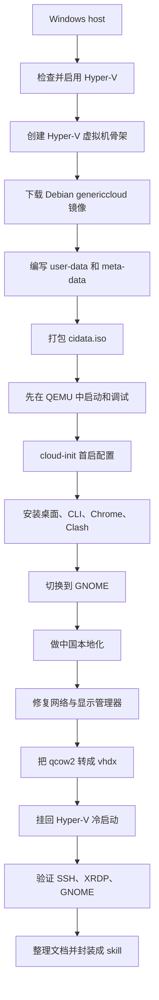

# Hyper-V Debian OpenClaw Skill

这是一个把 Debian GNOME 虚拟机做成“可重复构建、可调试、可沉淀为 skill”的示例项目。

项目的出发点很直接：在 Windows 的 Hyper-V 上做一台 Debian 虚拟机，预装 OpenClaw、Codex CLI、Gemini CLI、Claude Code、Google Chrome、Clash Verge，并且把整个制作过程写成文档和 skill，方便以后重复使用，而不是每次从零摸索。

这个仓库里同时包含两部分内容：

- 一份完整的制作与排障说明
- 一个可直接复用的 skill：`$hyperv-debian-openclaw-vm`

## 这个项目解决什么问题

如果你直接拿 Debian Live ISO 在 Hyper-V 里手工安装，短期能装好，但后面会遇到几个现实问题：

- 很难做成真正稳定的自动化
- cloud-init、镜像源、GNOME、显示管理器、网络这几类问题很容易互相叠加
- 一旦做坏，复盘成本很高
- 下次再做一遍时，大量步骤还得重新试

这个项目的方案不是“写一篇流水账笔记”，而是把整件事拆成可复用的工程流程：

- 用 Debian cloud image 作为基础系统盘
- 用 cloud-init 在首启时注入配置
- 先在 QEMU 里完成第一轮装机和修复
- 再把成品磁盘转回 Hyper-V
- 最后把经验沉淀成文档和 skill

## 最终交付长什么样

目标虚拟机是一台 Debian 13 GNOME 桌面机，适合直接拿来做 OpenClaw 和几套 AI CLI 的工作环境。

预期配置包括：

- Debian 13
- GNOME + gdm3
- SSH
- XRDP
- Node 22
- Python 3
- Git / GitHub CLI
- OpenClaw
- Codex CLI
- Gemini CLI
- Claude Code
- Google Chrome
- Clash Verge
- 中文本地化

## 整体流程



## 方案原理

这套方案的核心不是“拿安装器一步一步装系统”，而是：

1. 先拿一份已经装好基础系统的 cloud image
2. 用 cloud-init 在第一次启动时把用户、网络、软件安装、本地化脚本灌进去
3. 得到一块已经初始化完成的系统盘
4. 把这块成品盘挂到 Hyper-V 里长期使用

这里会有两类产物：

- 系统盘镜像：`qcow2` / `raw` / `vhdx`
- 配置介质：`cidata.iso`

要特别说明的是：

- `cidata.iso` 不是安装盘
- 它只是 cloud-init 的数据源载体
- 真正的系统主体在 cloud image 那块磁盘里

## 为什么不是直接用安装 ISO

这次实际探索过 Debian Live GNOME ISO，但最后放弃了。

原因很现实：

- 图形安装流程不适合做稳定自动化
- 需要反复点选，状态也不够可重建
- 一旦装完后再修 GNOME、网络、cloud-init，排障链路会很乱

相比之下，`genericcloud + cloud-init` 更适合“第一次就按目标状态去生成系统”。

## 为什么先在 QEMU 里做，再回到 Hyper-V

这是整个流程里最关键的工程决策。

Hyper-V 适合最终运行，但不适合第一轮密集调试。原因是：

- 首启阶段更难看日志
- cloud-init 和显示管理器问题不容易快速定位
- 一旦只剩 tty 或网络异常，回收调试成本高

QEMU 的优势是：

- 更容易暴露 SSH 端口
- 可以直接看串口
- 更适合快速试错和反复修

所以这套流程采用的是：

- 先在 QEMU 里做“首轮构建 + 排障”
- 再把修好的系统盘转回 Hyper-V

这比一开始死磕 Hyper-V 更稳。

## 制作流程说明

下面不是流水账，而是按“这一阶段要解决什么问题”来写。

### 1. 先把 Hyper-V 宿主机状态查清楚

第一步不是急着建虚拟机，而是确认宿主机有没有准备好。

常用检查命令：

```powershell
Get-WindowsOptionalFeature -Online -FeatureName Microsoft-Hyper-V-All
systeminfo
bcdedit /enum
```

如果 Hyper-V 没启用，可以这样做：

```powershell
Enable-WindowsOptionalFeature -Online -FeatureName Microsoft-Hyper-V -All -NoRestart
bcdedit /set hypervisorlaunchtype auto
```

重启之后，`systeminfo` 里应该能看到 hypervisor 已经接管。

### 2. 建一台 Hyper-V 虚拟机骨架

这一步只做骨架，不追求一步装好。

典型动作包括：

```powershell
New-VM -Name "Debian-Desktop" -Generation 2 -MemoryStartupBytes 4GB -SwitchName "Default Switch"
Set-VMProcessor -VMName "Debian-Desktop" -Count 8
Set-VM -Name "Debian-Desktop" -DynamicMemory -MemoryMinimumBytes 2GB -MemoryMaximumBytes 8GB
Set-VMFirmware -VMName "Debian-Desktop" -EnableSecureBoot On -SecureBootTemplate MicrosoftUEFICertificateAuthority
Add-VMDvdDrive -VMName "Debian-Desktop"
```

这一步得到的是：

- 一台二代虚拟机
- 带可调整的 CPU / 内存 / Secure Boot
- 预留了后续挂 seed ISO 的 DVD 驱动器

### 3. 选择 Debian cloud image，而不是传统安装器

这个项目最后选的是 Debian 官方 `genericcloud` 镜像。

官方入口：

- `https://cdimage.debian.org/images/cloud/trixie/latest/`

可以先看目录和元数据：

```powershell
curl.exe "https://cdimage.debian.org/images/cloud/trixie/latest/"
curl.exe "https://cdimage.debian.org/images/cloud/trixie/latest/debian-13-genericcloud-amd64.json"
```

这一步真正下载的是 cloud image，比如：

```powershell
curl.exe -L --output "C:\workspace\hyperv-debian-openclaw-skill\HyperV\Debian-Desktop\images\debian-13-genericcloud-amd64.qcow2" "https://cdimage.debian.org/images/cloud/trixie/latest/debian-13-genericcloud-amd64.qcow2"
```

### 4. 编写 cloud-init 所需的最小输入

这一步的输入只有两份文本：

- `user-data`
- `meta-data`

`user-data` 里通常放：

- 用户名和密码
- SSH 公钥
- 时区和 locale
- apt 源
- 包安装脚本
- 首启脚本

`meta-data` 通常至少放：

- `instance-id`
- `local-hostname`

这些文件在本项目里曾经放在：

- `automation/debian-vm/user-data`
- `automation/debian-vm/meta-data`

### 5. 把 cloud-init 数据打包成 `cidata.iso`

`cidata.iso` 的作用只是让 cloud-init 在首启时读到你提供的数据。

本项目用 `oscdimg` 来做：

```powershell
oscdimg -j1 -lcidata -m -o "<seed-files>" "<cidata.iso>"
```

如果你只记住一句话，那就是：

- cloud image 是系统本体
- `cidata.iso` 是首启配置载体

### 6. 在 QEMU 里完成第一轮装机

QEMU 这一步的目标不是长期运行，而是方便修系统。

一个典型启动方式是：

```powershell
"C:\workspace\hyperv-debian-openclaw-skill\tools\qemu-system-x86_64.exe" `
  -machine q35 `
  -m 4096 `
  -smp 8 `
  -drive file=<genericcloud.qcow2>,if=virtio,format=qcow2 `
  -cdrom <cidata.iso> `
  -nic user,model=virtio-net-pci,hostfwd=tcp::2222-:22 `
  -display none
```

这样宿主机就能通过：

```powershell
ssh -p 2222 claude@127.0.0.1
```

直接进来宾系统，效率比在 Hyper-V 里硬看登录界面高很多。

### 7. 在来宾里装实际要用的软件

这一阶段主要是把目标环境一次补齐。

系统层面一般会装：

```bash
apt-get install -y gdm3 gnome-shell gnome-session xrdp google-chrome-stable
```

Node 这次没有走 Debian 默认包，而是直接用官方 Node 22 发行包：

```bash
curl -fsSLO https://nodejs.org/dist/latest-v22.x/SHASUMS256.txt
curl -fsSLO https://nodejs.org/dist/latest-v22.x/node-v22.22.1-linux-x64.tar.xz
tar -C /usr/local --strip-components=1 -xJf node-v22.22.1-linux-x64.tar.xz
```

然后再给 `claude` 用户装全局 CLI：

```bash
npm install -g @openai/codex @google/gemini-cli @anthropic-ai/claude-code openclaw
```

Clash Verge 则直接用 GitHub release 的 `.deb`：

```bash
curl -fsSL -o /tmp/Clash.Verge_2.4.6_amd64.deb <release-url>
apt-get install -y /tmp/Clash.Verge_2.4.6_amd64.deb
```

### 8. 镜像源为什么最后改成 USTC

这次一开始尝试了清华源，但实际碰到的问题是：

- `apt update` 可能成功
- 真正装包时，大量 `pool/.../*.deb` 返回 `403 Forbidden`

所以在这台机器当前网络下，清华源不适合承担实际安装工作。

最终改成了 USTC：

```text
http://mirrors.ustc.edu.cn/debian/
http://mirrors.ustc.edu.cn/debian-security/
```

这不是审美选择，而是工程上的“能不能真正装完”的问题。

### 9. 把桌面切到 GNOME，并修显示管理器

中途为了先打通图形访问，曾短暂使用过 XFCE。

最终需求是 GNOME，所以做了两件事：

1. 安装 `gdm3 + gnome-shell + gnome-session`
2. 移除 `lightdm + xfce4`

真正导致“只看到 tty login” 的根因，是显示管理器链路残留了 `lightdm`。

修复动作是：

```bash
printf "/usr/sbin/gdm3\n" > /etc/X11/default-display-manager
ln -sf /usr/lib/systemd/system/gdm.service /etc/systemd/system/display-manager.service
systemctl daemon-reload
systemctl start gdm3
```

这个修复比单纯 `apt install gdm3` 更关键。

### 10. 做中国本地化

这一步的目标是让这台机不只是“能用”，而是“像在国内日常工作环境里那样用”。

这次做过的内容包括：

- 时区：`Asia/Shanghai`
- 语言：`zh_CN.UTF-8`
- 中文输入法：`ibus-libpinyin`
- GNOME 收藏项里加入 Chrome、终端、Clash Verge
- Clash Verge 登录后自启动

典型命令：

```bash
apt-get install -y ibus-libpinyin
update-locale LANG=zh_CN.UTF-8 LANGUAGE=zh_CN:zh
dconf update
```

### 11. 修 Hyper-V 兼容网络

QEMU 里能上网，不代表换到 Hyper-V 也能直接上网。

这次踩到的坑是：

- cloud-init 把网络配置绑死在 QEMU 的网卡名和 MAC 上
- 导致回到 Hyper-V 后系统能启动，但不配网

最终处理方式是：

- 禁止 cloud-init 继续覆盖网络
- 把 netplan 改成匹配 `en*` / `eth*`
- 使用 `networkd`

这类修复做完之后，系统盘才真正具备“可迁移回 Hyper-V”的条件。

### 12. 把成品盘转回 Hyper-V

当 QEMU 里的系统状态满意后，就可以转回 Hyper-V 了。

核心命令是：

```powershell
qemu-img convert -p -f qcow2 -O vhdx -o subformat=dynamic <input.qcow2> <output.vhdx>
```

然后把旧盘从 VM 上摘掉，换成新的 `vhdx`：

```powershell
Remove-VMHardDiskDrive -VMName "Debian-Desktop" -ControllerType SCSI -ControllerNumber 0 -ControllerLocation 0
Add-VMHardDiskDrive -VMName "Debian-Desktop" -ControllerType SCSI -ControllerNumber 0 -ControllerLocation 0 -Path "<final.vhdx>"
Set-VMDvdDrive -VMName "Debian-Desktop" -ControllerNumber 0 -ControllerLocation 1 -Path $null
```

最后做一次冷启动验证。

## 宿主机需要准备哪些工具

本项目实际用到过的宿主机工具是：

- Hyper-V PowerShell 模块
- `systeminfo`
- `bcdedit`
- `qemu-img`
- `QEMU`
- `OSCDIMG`
- `Git`
- `GitHub CLI`
- `Python`
- `OpenSSH` 客户端

## 仓库里有什么

如果你只想快速找到关键文件，看这里就够了。

- `docs/hyperv-debian-openclaw-vm-playbook.md`
  详细的构建与排障手册
- `docs/final-validation.md`
  最终验收记录
- `histoy.command`
  这次构建过程的归一化命令历史
- `skills/public/hyperv-debian-openclaw-vm/SKILL.md`
  skill 入口
- `skills/public/hyperv-debian-openclaw-vm/references/`
  流程、坑点、配置清单
- `skills/public/hyperv-debian-openclaw-vm/scripts/`
  宿主机检查脚本

## 相关来源

- Debian cloud images
  - `https://cdimage.debian.org/images/cloud/trixie/latest/`
- cloud-init NoCloud
  - `https://cloudinit.readthedocs.io/en/latest/reference/datasources/nocloud.html`
- Node.js
  - `https://nodejs.org/dist/latest-v22.x/`
- Clash Verge release
  - `https://github.com/clash-verge-rev/clash-verge-rev/releases/latest`
- Google Chrome Linux
  - `https://dl.google.com/linux/direct/google-chrome-stable_current_amd64.deb`

## 这个 skill 怎么用

本项目最终整理成了一个 skill：

- `$hyperv-debian-openclaw-vm`

适用场景：

- 从零构建 Debian GNOME on Hyper-V
- 修 cloud-init
- 修 GNOME / gdm3 / tty login
- 修从 QEMU 回到 Hyper-V 后的网络问题
- 复盘整个制作过程并生成文档

## 命令历史

这次执行过的关键命令已经整理到：

- `C:\workspace\hyperv-debian-openclaw-skill\source\histoy.command`

它不是原始终端逐字转储，而是便于复盘的标准化命令历史。
